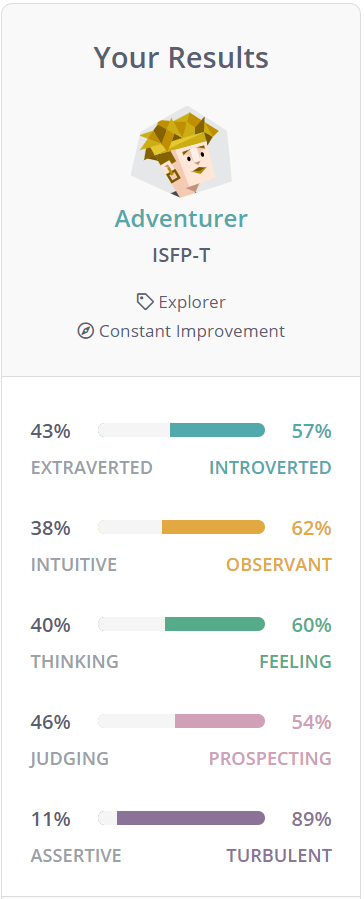
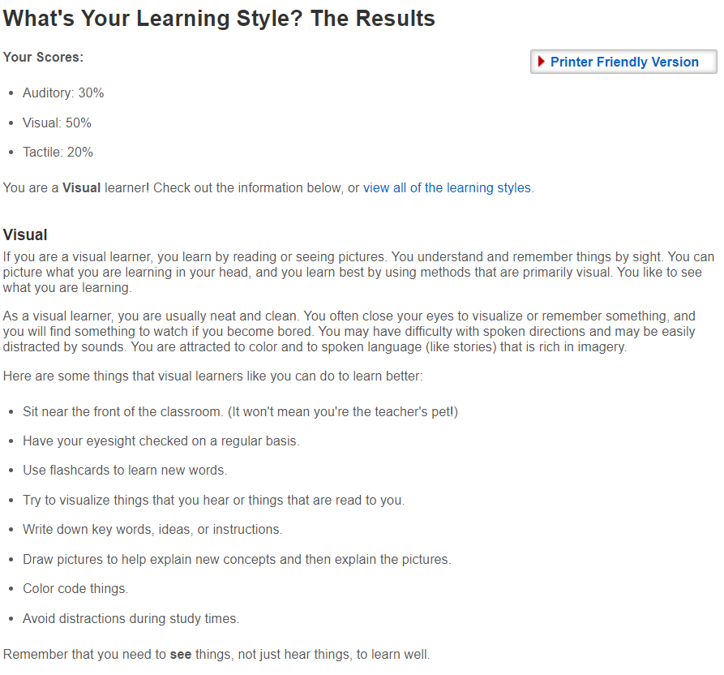

<!DOCTYPE html>
<html>
<head>
<title> ITT Assignment 1</title>
</head>
<body>
<h1> My IT Profile </h1>
<h2>About me</h2>

 

 My Name is Lori Williams, or s3824209 according to RMIT. 

 Born in Maitland, NSW which is about 38km inland from Newcastle, on the 29th of August 1997 and becoming the original pain in the arse for my Mum as I broke her tailbone while I was still in the womb shortly before birth. 

 Moved down state to the Far South Coast after my father graduated from the Police Academy in Goulburn in 2002 and haven’t left since. I attended the local schools and joined 222 Army Cadet Unit which I reached to the rank of SGT/Acting Warrant Officer Class 2, completing my HSC in 2015 from Moruya High School. 

 As of now, I live with my partner Matthew, and have been together for close to 3 years and we are both the humble servants of two animals as our overlords… A dopey black Labrador puppy who still doesn’t understand the concept of personal space, and a tiny but loud grey Blue Russian who only yells instead of a normal meow.... like a normal cat. 

<h2> Some slightly interesting facts about myself</h2>

 - I am the only daughter of my family and 3rd eldest out of 3 brothers. Eldest being a Military Police Officer in the K9 Unit up in QLD for the Army, the 2nd is studying for his Bacholar of Science at University of Wollongong, the youngest has just completed Year 12. 

 - The tip of my left index finger was chopped of by a heavy wooden door when I was 9mths old. Lucky it was saved thanks to surgery but unfortunately, I can’t play any stringed instruments. 

 - I am a very big coffee snob. Can’t drink coffee unless it’s been freshly grinded and dripped. This princess likes her coffee FRESH.

 - Avid Formula 1 fan and Legend of Zelda fan. Can normally be found watching anime or reading the manga or studying. Currently have an overwhelming urge to play S.T.A.L.K.E.R again.... Thanks Matt. >.> 

 - I have a terrible ear for accents but strangley enough, not for Eastern European accents. 

<h1> My Interest in IT </h1>

 My immense love for IT and computers started when I first heard the noise of dial up... strange, I know.

 When my Dad cracked open the old family laptop and tried to fix the faulty charging point, and after the illegitamet Office 365 Trojan malware fiasco, it kicked everything into montion of what I wanted to do in life.

 Since then, I've tried to centre myself around them through gaming via consoles, and the PCs at my schools from Apple and Microsoft to Linux.

 Tried to sigup for any IT realted classes in my senior years, espcailly for my HSC electives, but was cut due to lack of interest from both students and staff.

 Since graduation, I’ve worked at a local Telco as a Customer Service Representative then as a Technical Support Operator, assisting endusers with installation and setup of either, ADSL, NBN, Satellite or Mobile Broadband connections as well as configuring said services when required. As of 2019, I still work for them but now as a Billing Analyst in a small but closely knitted team. Currently we are mediating and migrating over 100,000 customers from the old accounts and billing platform that’s been in place for years, to our own platform which is to be launched at the start of 2020. Not only are we moving our customers, but also archiving and importing all our plans, past and present. This also includes the rates, inclusions, exclusions etc. Not an easy job sadly, but we power through it thanks to teamwork and communication. 

 Why did I choose RMIT? I actually chose RMIT back during my final year of High School and to do the exact same subject as I'm doing now. Sadly, I didn't go through with it due to my mental health.

 I'm estatic to finally follow through with my dream, keen to learn all there is to IT and everything related... Progrmming, IT system, Cyber Secuirty

<h1> Ideal Job </h1>

While I love every aspect of IT, my favourite field of it that would be my dream to have a career in would be Cyber Secuirty.

 I have come across a job on Seek.com.au in regards to a Cyber Secuirty Analysist Junior position that would be an ideal starting point for my career and to progress.

 This position would have me working in a 24x7 Secuirty Operations Centre with other Secuirty Analyst that would be responisble for the following:

 - Monitoring Networks/endpoints for any events or alerts for active threats,

 - Analyising any events from multiple sources like network intrustion systems and host based intrusion prevention tools. 

 Eg, Aplication whitelisting, AV Security Suite, and host intrusion prevention systems.

 - Monitoring and assessing any incoming threats or vulnerabilities and rectifying said issues.

 - Maintaining any deployed secuirty tools.

 - Constant review, and impovements to the overall security.

 The qualifications for this position are out of my reach for the time being, as they require at least 1 year experience in a Security Analytics role or in a security operations/network admin role.

 Sadly, I do not have the current experience to apply and be successful for this role, but this is why I am studying with RMIT, to further hone and exapnd the knowlegde in order to be successful. I've also requested from my current work if there's any positions related to IT.

 Click on the image below for more information on the position opening.

<h2> Personal Profile </h2>

The screenshot you'll see below are the results of three seperate tests, Myer-Briggs, learning and psychometric tests. 

 

 

 

 Over all with the results, they didn't come to too much of a surprise. Incidently it the same as what my manager had already described awhile ago and the learning test results were almost identical to the one I took back in High School. The mechanical aptitue test surprised me quite a bit as I initally believed I had gotten the majority of them wrong. 

 As I already work in a very small team and heavily rely on one another to get our objective completed. So for me, what I find important in building a team is trust, communication and the same goal in mind.

<h1> Project Ideas </h1>
<h2> Project Overview </h2>

 For this assignment, my idea is an automatic programmable plant watering system. This would be used for gardens that either have little to no rainfall and for gardens what cannot be watered on a regular basis like fulltime workers or for areas on heavy water restrictions. In theory, this would be programmed to release water on a timer, for a specific amount, or to be able to operate on solar to release the water. This could be easily achieved with a Raspberry Pi 3 as the price is low and the board is small enough to be concealed in a water/weatherproof case.

<h2> Motivation </h2>

 The montivation for the automatic watering system was for those who try to maintain a small garden but having either no time to water, like myself as I work fulltime then deticated to studying during any spare time, areas on heavy water restrictions or with severe dry humidity. The market for a 

<h2> Description </h2>

 The automatic watering system would have several features, the device would allow you to either manually program a time or times for the waterto be released. This means you can have it programmed to work more than once a day if the plant or vegtable required frequent watering. 

<h2> Tools & Technologies </h2>

 The tools and technology for this project can be easily sourced from local retailers like tech shops or Bunnings.

 -	The raspberry pi 3 board can be bought online for a cheap price. NOOBS for the RPi as it contains Raspbian and LibreELEC. 

 -	Regular hand and precision tools I already own so there’s no need for me to purchase any more, it also helps that my Father’s garage is well-equip if I ever need to borrow anything.
 

 -	A simple black and white display and buttons so the device can be used. 

 -	Water reservoir that can hold at least 1 litre. 

 -	Flexible thin tubing so the attachments can be made into what shape that’s required. 

 -	Mini Solar panels for providing power to the device. 

 -	Water/weatherproof plastic to create the housing of the mobo, pump etc. Looking towards Acrylic as it's durable, good for weather and easy to solvent bond together.. 

<h2> Skills Required </h2>

<h2> Outcome </h2>

</body>
</html>
